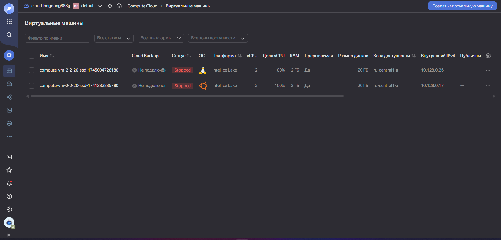
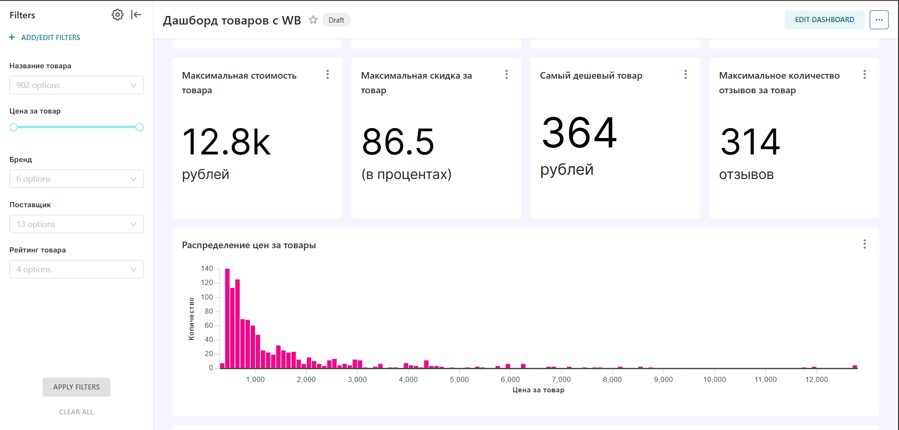

# 🛍️ WB Parser Bot + Superset Dashboard + Yandex Cloud


## 🔍 О проекте

**Автоматизированная система мониторинга товаров Wildberries с облачным развертыванием** - это комплексное решение для сбора, анализа и визуализации данных с популярного маркетплейса. Проект разработан в рамках курсовой работы по дисциплине "Облачные технологии в работе с большими данными"

Система позволяет:
- 🤖 Управлять процессом парсинга через Telegram-бота
- 📈 Автоматически создавать аналитические дашборды
- ☁️ Развертывать решение в облаке Yandex Cloud
- 🐳 Работать с полностью контейнеризированной инфраструктурой

## ✨ Ключевые особенности

- **Интеллектуальный парсинг** товаров по категориям, ценам и скидкам
- **Автоматическая генерация** интерактивных отчетов в Apache Superset
- **Готовое облачное решение** для быстрого развертывания
- **Простое управление** через Telegram-интерфейс
- **Масштабируемая архитектура** на базе Docker

## 🛠️ Технологический стек

### Основные технологии

| Компонент | Технологии |
|----------|------------|
| **Парсинг** |  |
| **Бэкенд** |  |
| **База данных** |  |
| **Визуализация** |  |
| **Инфраструктура** |   |
| **Облако** |  |


## 📂 Структура проекта

```
📦 wb-parser-project
├── 📂 init
│   └── 📄 01-create-user-db.sql       # SQL-скрипт инициализации БД
├── 📂 bot
│   ├── 📄 bot.py                     # Основной код Telegram-бота
│   ├── 📄 requirements.txt           # Зависимости для бота
│   └── 📄 run.sh                     # Скрипт запуска бота
├── 📂 parser
│   ├── 📄 __init__.py                # Инициализация Python-пакета
│   ├── 📄 Dockerfile-parser          # Конфигурация Docker для парсера
│   ├── 📄 parser_api.py              # API-интерфейс парсера
│   ├── 📄 python_test_case_1.py      # Основная логика парсера WB
│   └── 📄 requirements.txt           # Зависимости парсера
├── 📄 Dockerfile-bot                 # Конфигурация Docker для бота
├── 📄 Dockerfile-superset            # Конфигурация Superset
├── 📄 docker-compose.yml             # Оркестрация сервисов
├── 📄 .env                           # Переменные окружения
├── 📄 superset_config.py             # Конфигурация Superset
├── 📄 requirements.txt               # Общие зависимости
└── 📄 README.md                      # Документация проекта
```

## 🚀 Быстрый старт

### Предварительные требования
- Docker 20.10+
- Docker Compose 1.29+
- Аккаунт в Yandex Cloud (для облачного развертывания)

### Локальное развертывание

1. Клонируйте репозиторий:
```bash
git clone https://github.com/your-repo/wb-parser-bot.git
cd wb-parser-bot
```

2. Настройте окружение:
```bash
cp .env.example .env
nano .env  # Отредактируйте параметры
```

3. Запустите систему:
```bash
docker-compose up --build -d
```

4. Инициализируйте Superset:
```bash
docker-compose exec superset superset-init
```

### Развертывание в Yandex Cloud



1. Создайте ВМ в Yandex Cloud
2. Установите Docker и Docker Compose
3. Скопируйте проект на сервер
4. Запустите как для локального развертывания
5. Настройте группу безопасности для доступа к портам:
   - 8088 (Superset)
   - 8000 (API парсера)
   - 5432 (PostgreSQL)

## 🤖 Работа с системой

### Через Telegram-бота
1. Найдите своего бота в Telegram (в моем случае это **@WB_cloud_parcer_bot**)
2. Отправьте команду `/start`
3. Следуйте инструкциям:
   ```
   1. Отправьте ссылку на категорию WB
   2. Укажите диапазон цен (мин и макс)
   3. Задайте минимальную скидку
   4. Получите ссылку на дашборд
   * 👤 Логин: admin
   * 🔒 Пароль: admin
   ```


## 📊 Примеры дашборда



## ⚙️ Настройка

Основные параметры системы можно настроить через файл `.env`:

```ini
# Настройки базы данных
POSTGRES_USER=admin
POSTGRES_PASSWORD=secure_password
POSTGRES_DB=wb_data

# Настройки Telegram бота
BOT_TOKEN=your_telegram_bot_token

# Настройки парсера
MAX_PRODUCTS=500
REQUEST_DELAY=1.5
```

